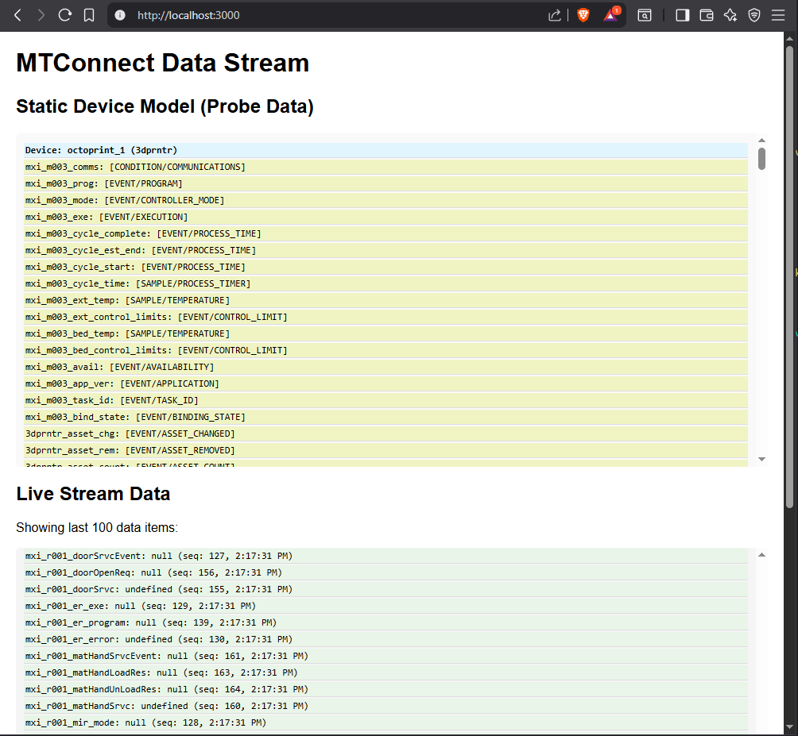

# mtconnect-ts
[MTConnect's REST protocol](https://model.mtconnect.org/#Package___19_0_4_45f01b9_1637706615628_274120_5004) and digital twin methods in typescript. Perfect for React apps.

**Huge credit to Will Sobel (Chief Architect of MTConnect) for his original work in [cppagent](https://github.com/mtconnect/cppagent).**

This library is born from [MTConnect's reference cppagent's demo.](https://github.com/mtconnect/cppagent/tree/main/demo/twin/lib/mtconnect)

Major changes include:
- translation from JavaScript to TypeScript
- adjustments to enable streaming multiple devices (whereas original presumed single device per instance)

## Demo
A basic demo is provided as an included npm script. 
### Run demo:
`cd to/repo/location` 
`npm install`
`npm build`

launch demo server specifying target agent url as launch arg
`npm run demo -- [targetAgentIP]:5000`

replace `[targetAgentIP]:5000` with your target agent's address and port

finally check out the demo at localhost:3000



## Install
### npm

`npm install mtconnect-ts`

### Local Install

Add it as a submodule to your project 

`git submodule add https://github.com/processrobotics/mtconnect-ts`

Build it 

`npm run build`

Install locally 

`cd path/to/your/project/root && npm run install ./path/to/submodule`

# Usage
## 1) Instatiate `Rest` class
```ts
import { Rest } from "@mx-interface/mtconnect-ts"

const rest = new Rest(`http://${host}`, (values: any) => {
	if (values.length !== 0) {
		values.forEach((item) => {
			console.log(item);
		}
	}
})
```
## 2) Probe
```ts
const probe = await rest.probeMachine();
console.log(probe)
```
## 3) Get Current Data from agent
```ts
await rest.current();
```
## 4) Stream updates from agent
```ts
await rest.streamSample();
```

